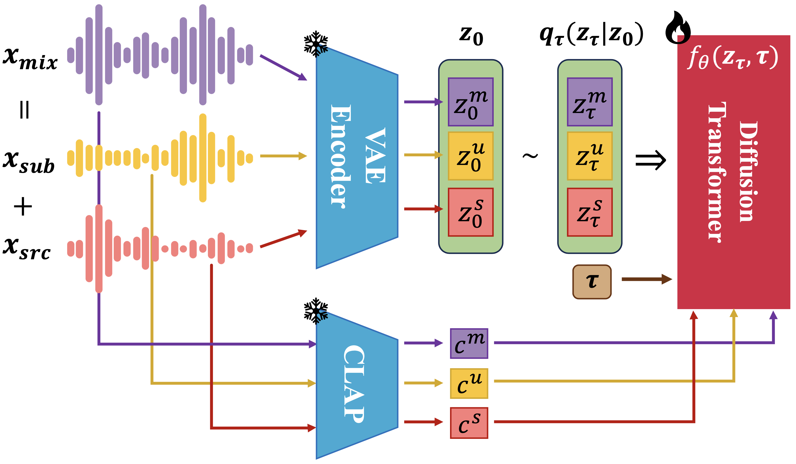
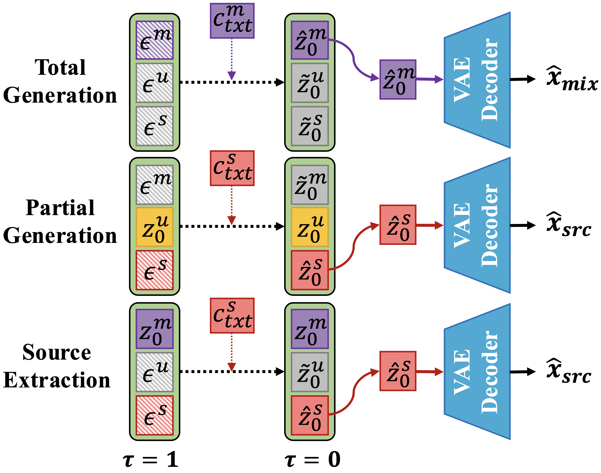

# 🎶 MGE-LDM

&#x20;

> **Official implementation of the paper Joint Latent Diffusion for Simultaneous Music Generation and Source Extraction.**

---

## 📋 Table of Contents

<!-- 1. [✨ Features](#✨-features) -->
1. [📖 Paper & Samples](#paper--samples)
2. [✨ Features](#features)
3. [⚙️ Installation](#installation)
4. [💾 Model Checkpoints](#model-checkpoints)
5. [🛠️ Process Overview](#process-overview)
6. [🚀 Inference](#inference)
7. [🔗 Reference](#reference)
8. [📚 Citation](#citation)

---

## 📖 Paper & Samples <a id="paper--samples"></a>

* **Paper**: [arXiv](https://arxiv.org/abs/2505.23305)
* **Sample Page**: [link](https://yoongi43.github.io/MGELDM_Samples/)
* **Real World Samples**: [link](https://agreeable-diplodocus-5ca.notion.site/Additional-Real-World-Audio-Samples-with-MGE-LDM-23644c3c089d80cfb46bdf3aed1ffd8b?source=copy_link)

---
## ✨ Features <a id="features"></a>
<!-- <div style="display: flex; gap: 1rem; align-items: flex-start;">
  <div style="width:55%; margin: 0;">
    
    <p style="text-align: center; margin-top: 0.5rem;">
      Training Overview<br>
    </p>
  </div>
  <div style="width:41%; margin: 0;">
    
    <p style="text-align: center; margin-top: 0.5rem;">
        Inference Workflow<br>
    </p>
  </div>
</div> -->

**Training / Inference Overview**
<div style="display: flex; gap: 1rem; align-items: center;">
  
  
</div>

MGE‑LDM can simultaneously generate music and extract sources - refer to the paper and the [🚀 Inference](#inference) section below for details.

- **Total Generation**  
  Generate a complete music track from a text prompt.
- **Source Extraction**  
  Extract desired individual sources (e.g., vocals, bass, drums) from a mixed audio using a text query.
- **Partial Generation**  
  Impute and add missing sources to an existing mix based on a textual description.
---


## ⚙️ Installation <a id="installation"></a>

1. **Clone the repo**:

   ```bash
   git clone https://github.com/yoongi43/MGE-LDM.git
   cd MGE-LDM
   ```
2. **Create environment**:

   ```bash
   conda env create -n mgeldm python=3.9
   conda activate mge-ldm
   ```
3. **Install dependencies**:

   ```bash
   conda install pytorch==2.3.1 torchvision==0.18.1 torchaudio==2.3.1 pytorch-cuda=12.1 -c pytorch -c nvidia
   ```
   ```
   pip install -r requirements.txt
   ```
---

## 💾 Model Checkpoints <a id="model-checkpoints"></a>

> **Note:** This checkpoint is distinct from the one used in the original paper; it was trained with additional data (MTG Jamendo, MedleyDB, etc.) and uses alternative hyperparameters.

**AutoEncoder**: [unwrapped_AE.ckpt](https://drive.google.com/file/d/1BmEUvakYYAPcQfn84Z9rioya08DzZqdp/view?usp=sharing)

**LDM (DiT)**: [unwrapped_DiT.ckpt](https://drive.google.com/file/d/1tyND8iI5Whs6_Oe-pBK2SpysGLKKa6sR/view?usp=sharing)

(Note: The DiT checkpoint includes both the diffusion model and autoencoder weights.
You do not need to download the autoencoder checkpoint separately for inference--only the DiT checkpoint is required.)

**CLAP Checkpoint**: download ```music_audioset_epoch_15_esc_90.14.pt``` from [laion_clap](https://github.com/LAION-AI/CLAP) repository.

---

## 🛠️ Process Overview <a id="process-overview"></a>

### 1. Download datasets
- [Slakh2100](https://zenodo.org/records/4599666)
- [MUSDB18](https://zenodo.org/records/3338373)
- [Moises](https://music.ai/research/)

### 2. Train AutoEncoder
Run the following script: ```bash scripts/train_ae.sh```


``` bash 
## See scripts/train_ae.sh

SAVE_DIR="/data2/yoongi/MGE_LDM"
CONFIG_NAME="default_ae" # See configs/default_ae.yaml for details.
GPU=0 # Set GPU ID
CKPT_PATH="" # Optional: Path to resume training

## Set CPU cores with `taskset -c` command.
CUDA_VISIBLE_DEVICES=$GPU \
taskset -c 64-79 \
python train_ae.py \
--config-name $CONFIG_NAME \
save_dir=$SAVE_DIR
# ckpt_path=$CKPT_PATH ## Add if resuming training.
```

After training, unwrap the AutoEncoder from pytorch lightning trainer by running the following script:

```bash scripts/unwrap_ae_script.sh```

```bash
## See scripts/unwrap_ae_script.sh
GPU=0 # Set GPU ID
CKPT_DIR="...MGE_LDM/default_ae/checkpoints/"
CKPT_PATH=$CKPT_DIR"last.ckpt"

OUTPUT_PATH=$CKPT_DIR"unwrapped_AE"

CUDA_VISIBLE_DEVICES=$GPU \
python unwrap_model.py \
    --config-name default_ae \
    +type=autoencoder \
    ckpt_path=${CKPT_PATH} \
    +use_safetensors=false \
    +output_name=${OUTPUT_PATH}
```

### 3. Data Prepration for LDM training
- Encode audio into latent representations and compute CLAP latents.
- Precompute and save all latents to ```pre_extracted_latents/``` to avoid on-the-fly computation overhead.
- See ```scripts/pre_encode_script.sh``` for details.


```
Structure of pre_extracted_latents:

pre_extracted_latents/
├── zero_latent.npy           # For salient segment loading
├── slakh2100/
│   ├── train/
│   │   ├──track00000/
│   │   │   ├── mix.npy
│   │   │   ├── mix_clap.npy
│   │   │   ├──comb0/
│   │   │   │   ├── src.npy
│   │   │   │   ├── src_clap.npy
│   │   │   │   ├── submix.npy
│   │   │   │   ├── submix_clap.npy
│   │   │   │   └── comb_info.json
│   │   │   ├──comb1/
│   │   │   │   ├── src.npy
│   │   │   │   ├── src_clap.npy
│   │   │   │   ├── submix.npy
│   │   │   │   ├── submix_clap.npy
│   │   │   │   └── comb_info.json
│   │   │   ...
│   │   ├──track00001/
│   │   ...
│   │
│   ├── valid/... 
│   ...
│   ├── test/...  
│
├── musdb18/...  # optional datasets
...
├── moisesdb/...  # optional datasets
...
```
---
### 4. Train Latent Diffusion Model

Run the following script to train MGE-LDM:
```bash scripts/train_dit.sh```
```bash
## See scripts/train_dit.sh
## Set CPU cores with `taskset -c` command.
GPU=0 # Set GPU ID
# GPU="6,7" # For multi-GPU training

SAVE_DIR="/data2/yoongi/MGE_LDM"
CONFIG_NAME="dit" # See configs/dit.yaml for details.
CKPT_PATH="" # Optional: Path to resume training

AE_CKPT_PATH=".../unwrapped_AE.ckpt" # Path to the unwrapped AutoEncoder checkpoint.

CUDA_VISIBLE_DEVICES=$GPU \
taskset -c 16-79 \
python train_dit.py \
--config-name $CONFIG_NAME \
save_dir=$SAVE_DIR \
autoencoder_ckpt_path=$AE_CKPT_PATH
# ckpt_path=$CKPT_PATH ## Add if resuming training.


# ## Mutlti-GPU Training
# CUDA_VISIBLE_DEVICES=$GPU \
# torchrun --nproc_per_node gpu train_dit.py \
# --config-name $CONFIG_NAME \
# save_dir=$SAVE_DIR
# autoencoder_ckpt_path=$AE_CKPT_PATH
```

After training, unwrap DiT from pytorch lightning trainer by running the following script:

```bash scripts/unwrap_dit_script.sh```

```bash
## See scripts/unwrap_dit_script.sh

GPU=0 # Set GPU ID
## Set config name / checkpoint path to unwrap.
CONFIG_NAME="dit"
CKPT_DIR="/data2/yoongi/MGE_LDM/${CONFIG_NAME}/checkpoints/"
CKPT_PATH=$CKPT_DIR"last.ckpt"

OUTPUT_PATH=$CKPT_DIR"unwrapped_DiT"

CUDA_VISIBLE_DEVICES=$GPU \
python unwrap_model.py \
    --config-name $CONFIG_NAME \
    +type=mgeldm \
    ckpt_path=${CKPT_PATH} \
    +use_safetensors=false \
    +output_name=${OUTPUT_PATH}
```


## 🚀 Inference <a id="inference"></a>
### Total Generation
Run ```bash scripts/infer_total_gen.sh```
```bash
## See scripts/infer_total_gen.sh

GPU=0 # Set GPU ID

CONFIG_NAME="dit"
# Path to the trained LDM checkpoint. Can be downloaded from the model checkpoint section.
CKPT_DIR="/data2/yoongi/MGE_LDM/${CONFIG_NAME}/checkpoints/"
CKPT_PATH=$CKPT_DIR"unwrapped_DiT.ckpt" 

OUTPUT_DIR="./outputs_infer/"

## Inference Condition
TASK="total_gen" # Total Generation
GEN_AUDIO_DUR=30.0 # Set the duration of the generated audio in seconds.
GIVEN_WAV_PATH=null

## Set text prompt here
TEXT_PROMPT="Lo-fi hip hop beat with mellow jazzy chords and a smooth bassline"
# TEXT_PROMPT="Upbeat electronic dance music with catchy synth melodies and driving bass"

## Generation Configuration
NUM_STEPS=50
CFG_SCALE=6.0
OVERLAP_DUR=5.0 ## Overlap duration in seconds for continuation. (MGE-LDM processes audio in chunks)
REPAINT_N=4 ## Multiple repainting steps for better quality (for continuation)


CUDA_VISIBLE_DEVICES=$GPU \
python infer.py \
    --config-name $CONFIG_NAME \
    +task=$TASK \
    ckpt_path=${CKPT_PATH} \
    +gen_audio_dur=${GEN_AUDIO_DUR} \
    +given_wav_path=${GIVEN_WAV_PATH} \
    "+text_prompt='${TEXT_PROMPT}'" \
    +num_steps=${NUM_STEPS} \
    +cfg_scale=${CFG_SCALE} \
    +overlap_dur=${OVERLAP_DUR} \
    +repaint_n=${REPAINT_N} \
    +output_dir=${OUTPUT_DIR}
```

### Source Extraction
Run ```bash scripts/infer_src_ext.sh```
```bash
## See scripts/infer_src_ext.sh
#!/bin/bash

GPU=0 # Set GPU ID
## Set checkpoint path
CONFIG_NAME="dit"
CKPT_DIR="/data2/yoongi/MGE_LDM/${CONFIG_NAME}/checkpoints/"
CKPT_PATH=$CKPT_DIR"unwrapped_DiT.ckpt"

OUTPUT_DIR="./outputs_infer/"

## Inference Condition
TASK="source_extract"

GIVEN_WAV_PATH="data_sample/bruno_24kmagic_seg.wav"
# GIVEN_WAV_PATH="data_sample/sakanaction_music_seg.wav"
# GIVEN_WAV_PATH="data_sample/charlie_attention_seg.wav"

TEXT_PROMPT="The sound of vocals"
# TEXT_PROMPT="The sound of drums"
# TEXT_PROMPT="The sound of the synthesizer"

## GEN / Inpaint Condition
NUM_STEPS=200
CFG_SCALE=10.0
OVERLAP_DUR=5.0
REPAINT_N=1 
 

CUDA_VISIBLE_DEVICES=$GPU \
python infer.py \
    --config-name $CONFIG_NAME \
    +task=$TASK \
    ckpt_path=${CKPT_PATH} \
    +given_wav_path=${GIVEN_WAV_PATH} \
    "+text_prompt='${TEXT_PROMPT}'" \
    +num_steps=${NUM_STEPS} \
    +cfg_scale=${CFG_SCALE} \
    +overlap_dur=${OVERLAP_DUR} \
    +repaint_n=${REPAINT_N} \
    +output_dir=${OUTPUT_DIR}
```
### Partial Generation (Source Imputation)
Run ```bash scripts/infer_partial_gen.sh```
```bash
## See scripts/infer_partial_gen.sh

GPU=0 # Set GPU ID
## Set checkpoint path
CONFIG_NAME="dit"
CKPT_DIR="/data2/yoongi/MGE_LDM/${CONFIG_NAME}/checkpoints/"
CKPT_PATH=$CKPT_DIR"unwrapped_DiT.ckpt"

OUTPUT_DIR="./outputs_infer/"

## Inference Condition
TASK="partial_gen"
GIVEN_WAV_PATH="data_sample/bruno_24kmagic_seg.wav"
# GIVEN_WAV_PATH="data_sample/sakanaction_music_seg.wav"
# GIVEN_WAV_PATH="data_sample/charlie_attention_seg.wav"


TEXT_PROMPT="The sound of the distorted guitar"
# TEXT_PROMPT="Jazz piano improvisation"
# TEXT_PROMPT="Guitar solo"
# TEXT_PROMPT="The sound of strings section"

## GEN / Inpaint Condition
NUM_STEPS=100
CFG_SCALE=6.0
OVERLAP_DUR=5.0
REPAINT_N=1


CUDA_VISIBLE_DEVICES=$GPU \
python infer.py \
    --config-name $CONFIG_NAME \
    +task=$TASK \
    ckpt_path=${CKPT_PATH} \
    +given_wav_path=${GIVEN_WAV_PATH} \
    "+text_prompt='${TEXT_PROMPT}'" \
    +num_steps=${NUM_STEPS} \
    +cfg_scale=${CFG_SCALE} \
    +overlap_dur=${OVERLAP_DUR} \
    +repaint_n=${REPAINT_N} \
    +output_dir=${OUTPUT_DIR}
```


## 🔗 Reference <a id="reference"></a>
The codes are build upon the following repositories:
* **Stable Audio Tools** by Stability-AI: [stable-audio-tools](https://github.com/Stability-AI/stable-audio-tools)
* **Friendly Stable Audio Tools** by Yukara Ikemiya: [friendly-stable-audio-tools](https://github.com/yukara-ikemiya/friendly-stable-audio-tools)

---

## 📚 Citation <a id="citation"></a>

```bibtex
@article{chae2025mge,
  title={MGE-LDM: Joint Latent Diffusion for Simultaneous Music Generation and Source Extraction},
  author={Chae, Yunkee and Lee, Kyogu},
  journal={arXiv preprint arXiv:2505.23305},
  year={2025}
}
```
